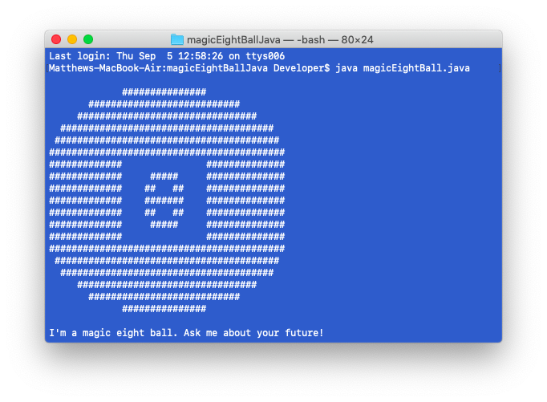
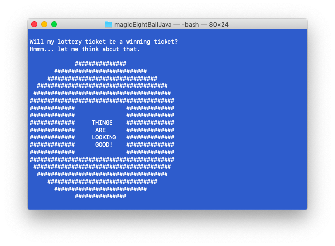
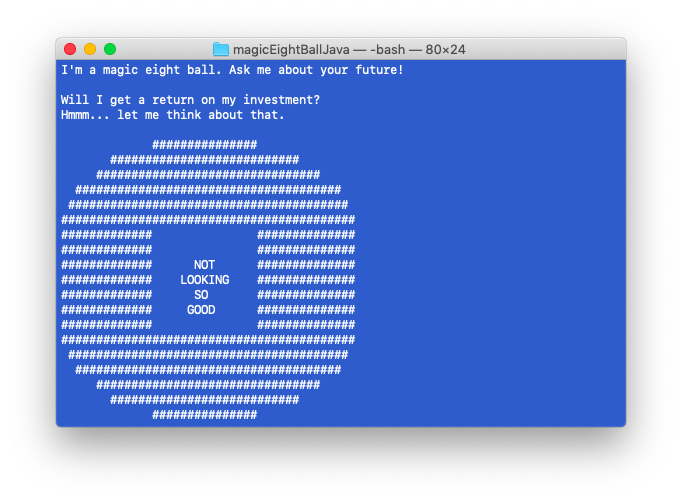
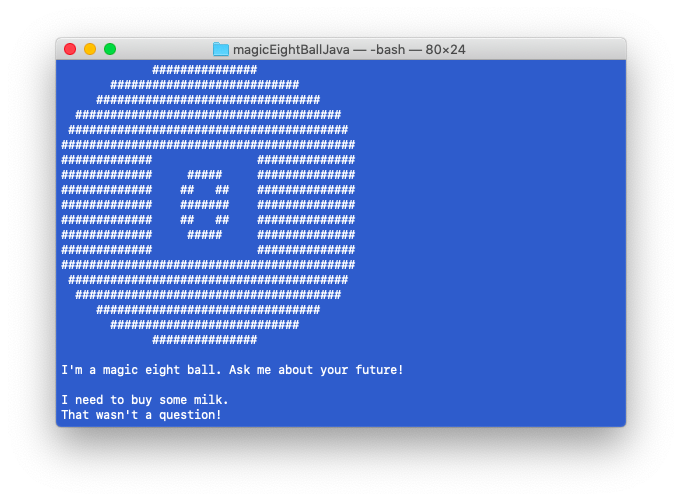

# **Career Coach**

## Credits

©2019 Matthew Farmer

## About

Magic Eight Ball is a command line application written in Java. Users can ask the eight ball a question and receive a random response. There exist 5 unique responses that a user may receive.

## Walkthrough

### Start

` java magicEightBall.java`

Users can run the program by typing  ` java magicEightBall.java` in the terminal and pressing Enter. The application will then prompt the user to submit a question. 

### Example One

In the example below, the user received the "Looking Good" response. This is just 1 of 5 possible responses.

### Example Two

In the example below, the user received the "Not Looking So Good" response. This is just 1 of 5 possible responses.

### Input Validation

The Magic Eight Ball will test to determine if a valid question was provided by attempting to locate a "?" in the input string. If a "?" is found, the Magic Eight Ball will proceed to provide a response. Otherwise, the Magic Eight Ball will alert the user that a valid question was not provided as demonstrated in the example below.

## Technologies Used

This application is written in Java. It imports java.util.Random for generating random numbers and java.util.Scanner for gathering user input.
